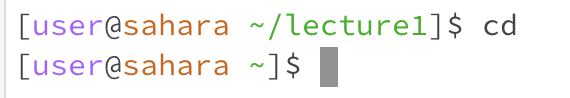
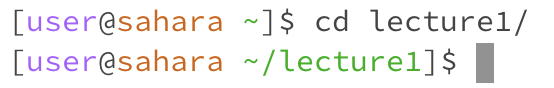
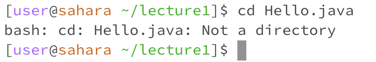
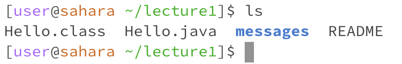
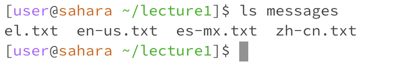
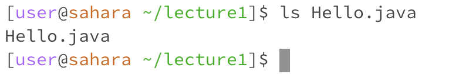
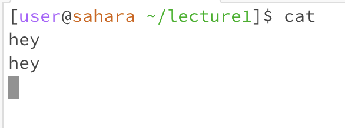
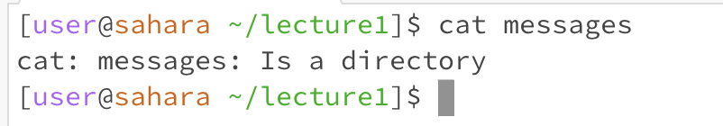
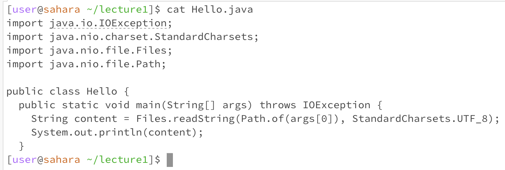

# Lab 1 Report

## cd command

1: No arguments
   

Working directory: `/home/lecture1`

When we do the `cd` command with no arguments, we get moved from our current directory to the `/home` directory. We can see this reflected in the terminal as we've moved from `/home/lecture1` to `/home` despite not putting `home` as an argument. Not an error.

---
2: Directory

Working directory: `/home` (home directory).

We get sent to the `/home/lecture1` directory because we gave `lecture1` (a directory within `/home`) as an argument, allowing us to change directories properly. This is reflected in the terminal in line 2, as we've moved from `[user@sahara ~]` to `[user@sahara ~/lecture1]`. In other words, our output is the fact that we moved from `/home` to `/home/lecture1`. No errors occurred.

---
3: File

Working directory: `/home/lecture1`

The output is an error message saying `Hello.java` is not a directory. The `cd` command is meant specifically to change our current working directory, so a file argument would naturally cause an error because a file, unlike a directory, is not exactly a path we can go to in order to access other relative files/folders (a file simply can't contain other files/folders).

## ls command

1: No arguments
   

Working directory: `/home/lecture1`

The output of the `ls` command with no arguments is a list of every file and directory within our current working directory (`/home/lecture1` in this case), which is why we see `Hello.class`, `Hello.java`, `messages`, and `README`. The output is not an error.

---
2: Directory

Working directory: `/home/lecture1`

Our output is every .txt file within the `messages` directory, because when using the `ls` command with a directory as an argument, the output will be a list of all the files and directories within the specified directory. In this case, the `messages` directory only has .txt files and no directories within it, so our output reflects that. No errors here.

---
3: File

Working directory: /home/lecture1

Our output when giving a file as an argument is the file itself (`Hello.java` in this case). This is not an error, and isn't really presented as such. There are simply no files or directories "within" the specified file argument (since files can't hold stuff like directories/folders do), so as a result the `ls` command just lists the file itself, which is perfectly valid.

## cat command

1: No arguments

Working directory: `/home/lecture1`

When we do `cat` with no args, we haven't provided a file argument for it to read from, so it instead it will read from the standard input (as in, whatever we input in the terminal). Thus, when I wrote `hey` in the terminal, it outputted `hey` back to me. It will remain like this unless we exit by doing CONTROL+C. This is not an error, as there is no error message or the like (and we get understandable, though perhaps not very desirable, outputs).

---
2: Directory

Working directory: `/home/lecture1`

The output is an error message since we provided a directory (`messages`) as an argument. The `cat` command only prints the contents of one or more files. Trying to print the contents of a directory/folder would be quite complicated and unrealistic given that they often hold sub-directories and numerous files. As such, when we provide a directory as an argument, we get an error message hinting that we need to provide a file as an argument instead.

---
3: File

Working directory: `/home/lecture1`

We get the contents of the `Hello.java` file as the output because `cat` prints the contents of a file to the terminal, and we correctly specified a file as an argument. `Hello.java` is a file within our working directory (`/home/lecture1`) so the `cat` command was able to print the contents properly with no errors.

