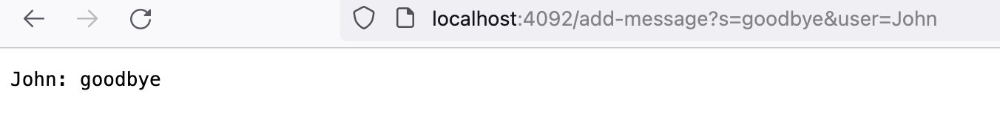
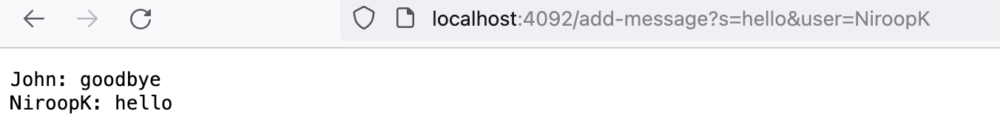

# Lab 2 Report

## Part 1: WebServer.java Code
---

``` 
import java.io.IOException;
import java.net.URI;
import java.util.ArrayList;

class Handler implements URLHandler {
    // The one bit of state on the server: a number that will be manipulated by
    // various requests.
    String userMessages = "";

    public String handleRequest(URI url) {
        if (url.getPath().equals("/add-message")) {
            String[] parameters = url.getQuery().split("&");
            String[] msgParams = parameters[0].split("=");
            String[] userParams = parameters[1].split("=");
            userMessages += userParams[1] + ": " + msgParams[1] + "\n";
            return userMessages;
        }  
        return "404 Not Found!"; 
    }
}

class ChatServer {
    public static void main(String[] args) throws IOException {
        if(args.length == 0){
            System.out.println("Missing port number! Try any number between 1024 to 49151");
            return;
        }

        int port = Integer.parseInt(args[0]);

        Server.start(port, new Handler());
    }
}
```

Using the add command:



Before getting to the screenshot, the first method called is the `main` method, which starts the server on the specified port when we run `java WebServer <port>` in the terminal. 

In this screenshot, the `handleRequest` method within the `Handler` class is called. It takes a `URI` argument named `url`, which in this case is literally our url: `http://localhost:4092/add-message?s=goodbye&user=John`. The only field in the `Handler` class is the String `userMessages`. It starts off blank, but when we perform this request, we concatenate (add to) the `userMessages` variable using the request data. We add the user (`john`), a colon (`: `), the message (`goodbye`), and finally a new line `\n`, so that when we add the next person's message, it is on a different line despite being part of the same variable.

---



