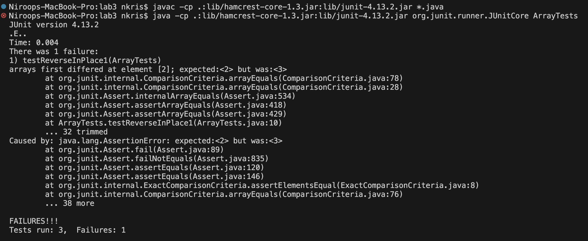

# Lab 3 Report

## Part 1: Bugs

### Failure-Inducing Input
``` 
@Test 
public void testReverseInPlace1() {
  int[] input2 = {1, 2, 3, 4};
  ArrayExamples.reverseInPlace(input2);
  assertArrayEquals(new int[]{4, 3, 2, 1}, input2);
}
```

### Input That Doesn't Induce a Failure
```
@Test 
public void testReverseInPlace2() {
  int[] input1 = { 3 };
  ArrayExamples.reverseInPlace(input1);
  assertArrayEquals(new int[]{ 3 }, input1);
}
```

### Symptoms (Test Output)



As we can see, only `testReverseinPlace1` failed, because the method returned `{4, 3, 3, 4}` rather than `{4, 3, 2, 1}`.

### The Bug (Before-and-After Code)
Before:
```
static void reverseInPlace(int[] arr) {
  for(int i = 0; i < arr.length; i += 1) {
    arr[i] = arr[arr.length - i - 1];
  }
}
```

After:
```
static void reverseInPlace(int[] arr) {
  for(int i = 0; i < arr.length/2; i += 1) {
    int temp = arr[i];
    arr[i] = arr[arr.length - i - 1]; 
    arr[arr.length - i - 1] = temp;
  }
}
```

The main bug with the original code is that it iterates through the entire array and sets the current element equal to the element on the opposing 
side. For an array of size 1 (as in `testReverseInPlace2`), this causes no issues because that singular element is just assigned to itself. 
But for arrays with sizes greater than 1, elements past `arr.length / 2` are assigned the values of the opposing, earlier elements which have already been
changed, or "reversed." The fix addresses this by iterating through only half of the array (`array.length / 2`) and creating a `temp` value containing the 
current element's value. This way, after changing the value of the current element, we can then assign its old value, `temp`, to the element on 
the opposing side of the array. Thus, we end up with a properly-reversed array.
