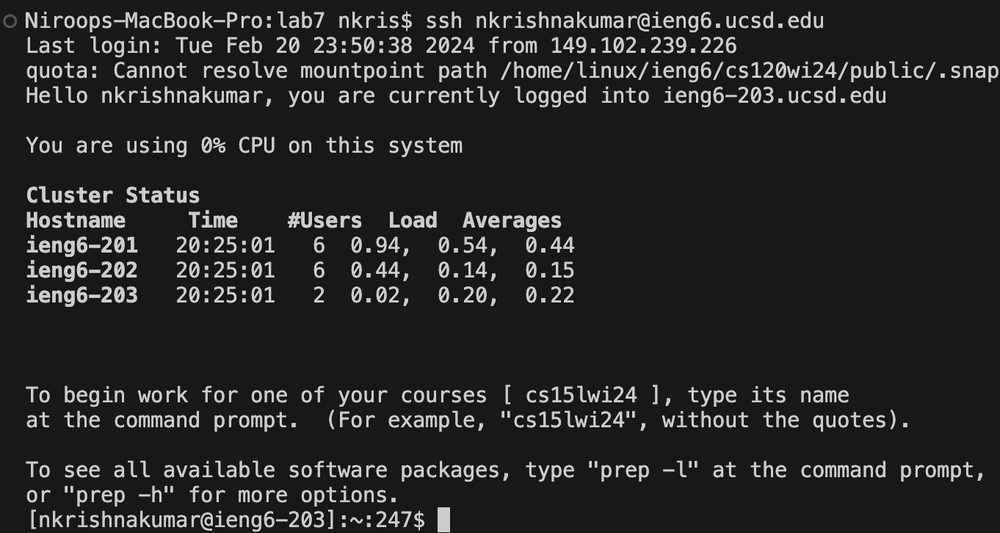

# Lab 4 Report

## Step 4: Log into SSH 

Keys pressed: `<up><up><enter>`. The `ssh nkrishnakumar@ieng6.ucsd.edu` command was 2 up in my search history so I accessed it with the up arrow (it was in my history since I had done steps 4-9 as practice before this report).

## Step 5: Clone Repository Fork

Keys pressed: `<Ctrl-R>clone<enter>`. I thought pressing <up> to search for the `git clone git@github.com:nk4444/lab7.git` command might take a while so I used `<Ctrl-R>` to access my bash history and searched for `clone`. The command was found and the clone occurred successfully.

## Step 6: Run Tests (Fail)

Keys pressed: `<up><up><up><up><enter>`, then `<Ctrl-R>bash<enter>`. The `cd lab7` command, which I needed to move from my home directory to `lab7`, was 4 up in my search history so I accessed it with the up arrow. Then I searched for the `bash test.sh` command by using `<Ctrl-R>` and typing `bash` (since I was pretty sure it would take more `<up>` keys to reach than the `cd lab7` command). Thus, the tests ran and failed as expected.

## Step 7: Edit Code

Keys pressed: `<Ctrl-R>v<enter>`, then `<43<enter>lllllr2<esc>:wq!`. First I wanted to use the vim editor to change `ListExamples.java`, but I didn't know how far back the `vim ListExamples.java` command was in my search history so I first accessed that by using `<Ctrl-R>` and typing `v`. The command I wanted showed up with just one letter, which was nice. Once I got to the editor, I typed `43` and <enter> to reach the line number I needed to change. Then I typed `lllll` to go right and reach the letter I needed to change. After that, I typed `r2` to replace the character at my cursor with `2`. Finally I exited insert mode with `<esc> and saved my changes by typing `:wq!` (which also closed the editor in the process).

## Step 8: Run Tests (Success)

Keys pressed: `<up><up><enter>`. The `bash test.sh` command was only 2 up in my search history so I was able to use the up arrow to access it. As you can see in the screenshot, the tests ran successfully.

## Step 9: Commit and Push

Keys pressed: `<Ctrl-R>add<enter>`, then `<Ctrl-R>commit<enter>`, then `<Ctrl-R>push<enter>`. Since I had already done a test run during the lab (in which I pushed my changes to github), I knew I had the necessary commands in my history. Thus, to reach the `git add .` command, which would move all changed files to the staging area, I typed `<Ctrl-R>` and searched for `add`. After that I used `<Ctrl-R>` two more times to find my `git commit -m "changed index1 to index2` command and my `git push origin` command. Thus I was able to commit my changes and push them to my fork.

