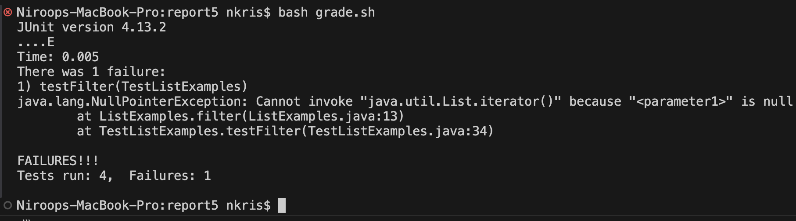
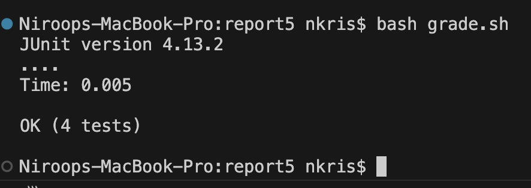

# Lab 5 Report

## Part 1: Debugging Scenario

### Student Post:
Hello,




### TA Response:

### Screenshot of What Student Got After Trying That + Bug Description


## Setup Info:

### File Structure

```
report5/
|-  lib
     |-  hamcrest-core-1.3.jar
     |-  junit-4.13.2.jar
|-  grade.sh
|-  ListExamples.java
|-  TestListExamples.java
(NOTE: FILES AFTER THIS POINT ARE CLASS FILES GENERATED AFTER RUNNING)
|-  IsMoon.class
|-  ListExamples.class
|-  StringChecker.class
|-  TestListExamples.class
```

## Contents of Files
Note: Will ignore lib and the class files since they were not touched.

ListExamples.java

TestListExamples.java

grade.sh

### Command Triggering Bug

### Description of Edit to Fix


## Part 2: Reflection


